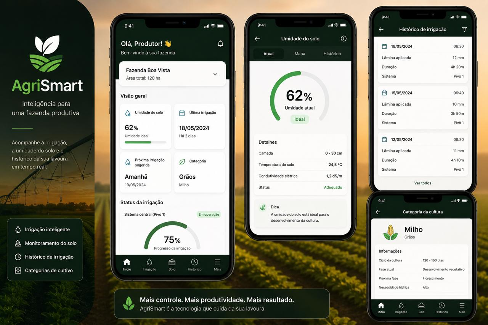

# 🌱 AgriSmart - Automação para Fazenda Produtiva

Projeto acadêmico que simula um sistema de irrigação inteligente, com coleta de dados via Arduino e um protótipo de aplicativo para visualização em tempo real.

## 💡 Sobre o projeto

O AgriSmart tem como objetivo ajudar produtores a monitorar e automatizar a irrigação de suas lavouras, acompanhando:

- Umidade do solo em tempo real
- Histórico de irrigação
- Sugestão de próxima irrigação
- Categorias de cultivo (com necessidades específicas por tipo de planta)

## ⚙️ Como funciona

O Arduino coleta dados de sensores (umidade do solo, temperatura, etc.) e envia essas informações, que seriam exibidas no aplicativo através do painel de controle.

## 🛠️ Tecnologias utilizadas

- **Hardware/Firmware:** Arduino (C/C++)
- **Sensores:** Umidade do solo, temperatura
- **Protótipo de interface:** Figma

## 📱 Protótipo do aplicativo

O design do app foi prototipado no Figma, simulando a experiência do usuário final:

## 🚀 Próximos passos

- Implementar o back-end para comunicação real entre Arduino e aplicativo
- Desenvolver o front-end funcional do app
- Adicionar autenticação de usuários e múltiplas fazendas

## 👤 Autor

Ivanildo [seu sobrenome] — Estudante de Análise e Desenvolvimento de Sistemas
[Link do LinkedIn]
